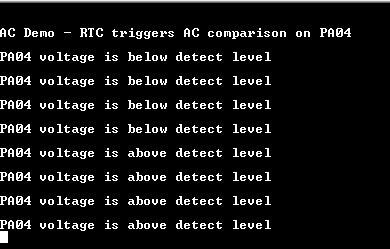

# AC Sleepwalking

This example application shows how to use the AC Peripheral library to perform a single shot comparison in standby sleep mode periodically and wake up the device at the end of a successful comparison.

## Description

Single shot conversion is triggered by RTC compare event. Generation of a trigger and compare operation are done while the CPU is in the standby sleep mode. AC generates the interrupt on the end of the comparison which wakes the CPU.

## Downloading and building the application

To download or clone this application from Github, go to the [top level of the repository](https://github.com/Microchip-MPLAB-Harmony/csp_apps_sam_d5x_e5x) and click

Path of the application within the repository is **apps/ac/ac_sleepwalk_singleshot/firmware** .

To build the application, refer to the following table and open the project using its IDE.

| Project Name      | Description                                    |
| ----------------- | ---------------------------------------------- |
| sam_e54_xpro.X    | MPLABX Project for [SAM E54 Xplained Pro board](https://www.microchip.com/developmenttools/ProductDetails/atsame54-xpro)|
|||

## Setting up the hardware

The following table shows the target hardware for the application projects.

| Project Name| Board|
|:---------|:---------:|
| sam_e54_xpro.X    | [SAM E54 Xplained Pro board](https://www.microchip.com/developmenttools/ProductDetails/atsame54-xpro)|
|||

### Setting up [SAM E54 Xplained Pro board](https://www.microchip.com/developmenttools/ProductDetails/atsame54-xpro)

- Connect a voltage below VDD to AC-AIN0 (pin 14 of the EXT1 connector)
- Connect the Debug USB port on the board to the computer using a micro USB cable

## Running the Application

1. Open the Terminal application (Ex.:Tera term) on the computer
2. Connect to the EDBG Virtual COM port and configure the serial settings as follows:
    - Baud : 115200
    - Data : 8 Bits
    - Parity : None
    - Stop : 1 Bit
    - Flow Control : None
3. Build and Program the application using its IDE
4. Observe output message in console as follows:

    

5. Console displays the message stating whether voltage at AC input is lower or greater than the internal bandgap voltage (1.1 V)
6. LED toggles when comparison is done

Below table shows the AC input pin and LED name for the board:

| Board| AC input pin | LED name|
|------|----------|---------|
|[SAM E54 Xplained Pro board](https://www.microchip.com/developmenttools/ProductDetails/atsame54-xpro) | AC-AIN0 (pin 14 of the EXT1 connector)| LED0 |
|||
