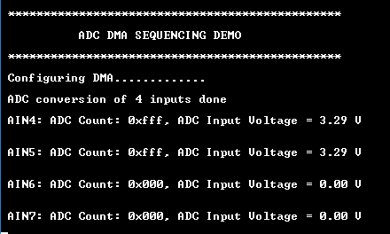

# ADC DMA sequencing

This application shows how to use DMA sequencing feature available in ADC peripheral library.

## Description

DMA sequencing feature enables user to reconfigure the ADC using DMA. The example application uses the DMA sequencing feature to write to MUXPOS bit field in the INPUTCTRL register to select input pin before an ADC conversion.

Two DMA channels are used in this application. One channel to copy the results from ADC result register to an array in SRAM, another DMA channel to copy new MUXPOS value to the INPUTCTRL register. ADC DMA sequencing trigger is used as trigger source for the second DMA channel which updates INPUTCTRL. RTC peripheral acts as a trigger to start ADC conversion.

ADC data is printed on the USART console via EDBG Virtual COM Port in hexadecimal format.

## Downloading and building the application

To clone or download this application from Github, go to the [main page of this repository](https://github.com/Microchip-MPLAB-Harmony/csp_apps_sam_d5x_e5x) and then click **Clone** button to clone this repository or download as zip file.
This content can also be downloaded using content manager by following these [instructions](https://github.com/Microchip-MPLAB-Harmony/contentmanager/wiki).

Path of the application within the repository is **apps/adc/adc_dma_sequencing/firmware** .

To build the application, refer to the following table and open the project using its IDE.

| Project Name      | Description                                    |
| ----------------- | ---------------------------------------------- |
| sam_e54_xpro.X    | MPLABX Project for [SAM E54 Xplained Pro board](https://www.microchip.com/developmenttools/ProductDetails/atsame54-xpro)|
|||

## Setting up the hardware

The following table shows the target hardware for the application projects.

| Project Name| Board|
|:---------|:---------:|
| sam_e54_xpro.X    | [SAM E54 Xplained Pro board](https://www.microchip.com/developmenttools/ProductDetails/atsame54-xpro)|
|||

### Setting up  [SAM E54 Xplained Pro board](https://www.microchip.com/developmenttools/ProductDetails/atsame54-xpro)

- ADC input pins available on the board are AIN4(PA04), AIN5(PA05), AIN6(PA06) and AIN7(PA07)
  - Analog input "AIN4" is mapped to Port Pin "PA04" that is routed to "Pin 14 of the EXT1 header"
  - Analog input "AIN5" is mapped to Port Pin "PA05" that is routed to "Pin 13 of the EXT1 header"
  - Analog input "AIN6" is mapped to Port Pin "PA06" that is routed to "Pin 5 of the EXT1 header"
  - Analog input "AIN7" is mapped to Port Pin "PA07" that is routed to "Pin 6 of the EXT1 header"
- Use a jumper wire to Connect analog input pins to external voltage source or to Vcc or GND
- Connect the Debug USB port on the board to the computer using a micro USB cable

## Running the Application

1. Open the Terminal application (Ex.:Tera term) on the computer
2. Connect to the EDBG Virtual COM port and configure the serial settings as follows:
    - Baud : 115200
    - Data : 8 Bits
    - Parity : None
    - Stop : 1 Bit
    - Flow Control : None
3. Build and Program the application using its IDE
4. Observe output message in console as follows:

    
