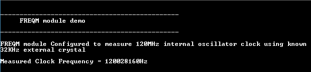

# FREQM measurement

This example application demonstrates how to use the FREQM peripheral to measure the frequency of the internal RC Oscillator.

## Description

The Frequency Meter (FREQM) can be used to accurately measure the frequency of a clock by comparing it to a known reference clock. The FREQM counts the number of periods of the measured clock with respect to the reference clock. This example application shows how to measure the cpu frequency using the 32-kHz Crystal oscillator as the reference clock.

## Downloading and building the application

To download or clone this application from Github, go to the [top level of the repository](https://github.com/Microchip-MPLAB-Harmony/csp_apps_sam_d5x_e5x) and click

Path of the application within the repository is **apps/freqm/freqm_measure_clock_freq/firmware** .

To build the application, refer to the following table and open the project using its IDE.

| Project Name      | Description                                    |
| ----------------- | ---------------------------------------------- |
| sam_e54_xpro.X    | MPLABX Project for [SAM E54 Xplained Pro board](https://www.microchip.com/developmenttools/ProductDetails/atsame54-xpro)|
|||

## Setting up the hardware

The following table shows the target hardware for the application projects.

| Project Name| Board|
|:---------|:---------:|
| sam_e54_xpro.X    | [SAM E54 Xplained Pro board](https://www.microchip.com/developmenttools/ProductDetails/atsame54-xpro)|
|||

### Setting up [SAM E54 Xplained Pro board](https://www.microchip.com/developmenttools/ProductDetails/atsame54-xpro)

- Connect an oscilloscope to monitor the PORT pin PB15 (Pin 8 of the EXT2 header)
- Connect the Debug USB port on the board to the computer using a micro USB cable

## Running the Application

1. Open the Terminal application (Ex.:Tera term) on the computer
2. Connect to the EDBG Virtual COM port and configure the serial settings as follows:
    - Baud : 115200
    - Data : 8 Bits
    - Parity : None
    - Stop : 1 Bit
    - Flow Control : None
3. Build and Program the application using its IDE
4. Observe output message in console as follows:

    

    *Note that the measured clock frequency is approximate. The actual frequency may vary because of measurement error*
