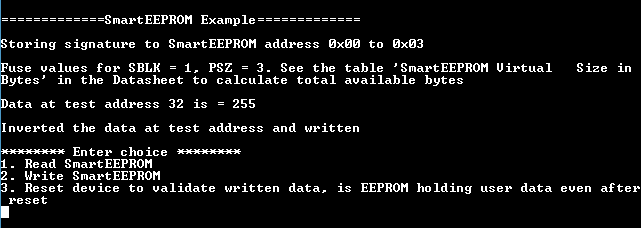
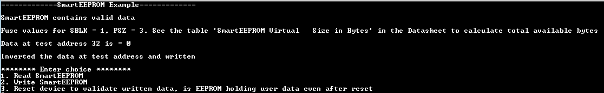
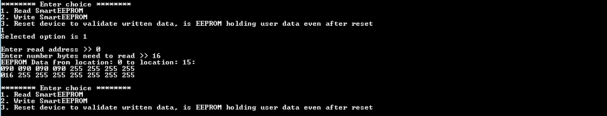
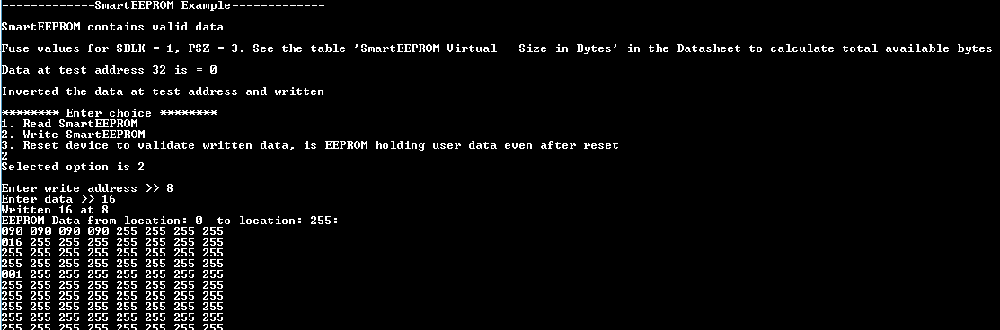
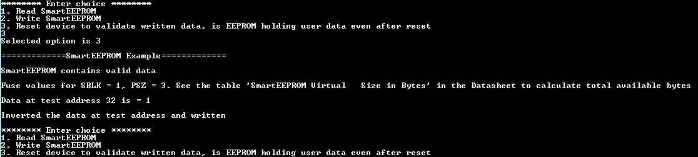

# NVMCTRL SmartEEPROM

This example application demonstrates how to use the SmartEEPROM feature in NVMCTRL PLIB to erase and program the internal Flash memory. 8-bit, 16-bit, 32-bit access is supported.

## Description

This SmartEEPROM feature is provided through the AHB2 interface and makes a portion of the NVM appear like a RAM. This example uses the NVMCTRL peripheral library to read or write a 8-bit data to the internal flash memory by using SmartEEPROM feature. This application demonstrates Read data from internal flash, Write data into internal flash. Along with these options,"Reset device" option also available in this demo to validate written data. This will be useful to check if EEPROM is holding user data even after reset.

## Downloading and building the application

To download or clone this application from Github, go to the [top level of the repository](https://github.com/Microchip-MPLAB-Harmony/csp_apps_sam_d5x_e5x) and click

Path of the application within the repository is **apps/nvmctrl/nvmctrl_smarteeprom/firmware** .

To build the application, refer to the following table and open the project using its IDE.

| Project Name      | Description                                    |
| ----------------- | ---------------------------------------------- |
| sam_e54_xpro.X    | MPLABX Project for [SAM E54 Xplained Pro board](https://www.microchip.com/developmenttools/ProductDetails/atsame54-xpro)|
|||

## Setting up the hardware

The following table shows the target hardware for the application projects.

| Project Name| Board|
|:---------|:---------:|
| sam_e54_xpro.X    | [SAM E54 Xplained Pro board](https://www.microchip.com/developmenttools/ProductDetails/atsame54-xpro)|
|||

### Setting up [SAM E54 Xplained Pro board](https://www.microchip.com/developmenttools/ProductDetails/atsame54-xpro)

- Connect the Debug USB port on the board to the computer using a micro USB cable

## Running the Application

1. Open the Terminal application (Ex.:Tera term) on the computer
2. Connect to the EDBG Virtual COM port and configure the serial settings as follows:
    - Baud : 115200
    - Data : 8 Bits
    - Parity : None
    - Stop : 1 Bit
    - Flow Control : None
3. Build and Program the application using its IDE
4. See the following message in the console:

    - After programming the application

    

    - After Resetting the device

    

5. Enter 1 and see the following message in the console:

    

6. Enter 2 and see the following message in the console:

    

7. Enter 3 and see the following message in the console:

    

8. LED status will toggle on every reset

Following table provides the LED name:

| Board      | LED Name |
| ---------- | ---------------- |--------- |
| [SAM E54 Xplained Pro board](https://www.microchip.com/developmenttools/ProductDetails/atsame54-xpro)    | LED0 |
|||
