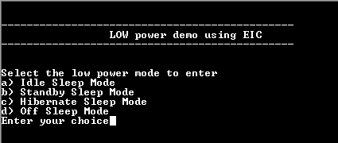
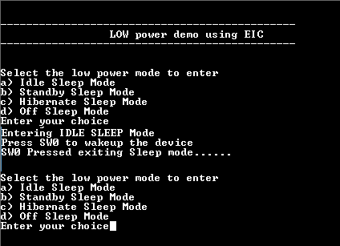

# PM wakeup using EIC

This application demonstrates entering the low power modes and exiting it using the EIC.

## Description

The PM peripheral library is used to enter the low power mode and the device exits low power mode when the button is pressed. To identify a button push, the EIC is configured to detect a falling edge on the GPIO pin connected to the switch.

## Downloading and building the application

To download or clone this application from Github, go to the [top level of the repository](https://github.com/Microchip-MPLAB-Harmony/csp_apps_sam_d5x_e5x) and click

Path of the application within the repository is **apps/pm/pm_wakeup_eic/firmware** .

To build the application, refer to the following table and open the project using its IDE.

| Project Name      | Description                                    |
| ----------------- | ---------------------------------------------- |
| sam_e54_xpro.X    | MPLABX Project for [SAM E54 Xplained Pro board](https://www.microchip.com/developmenttools/ProductDetails/atsame54-xpro)|
|||

## Setting up the hardware

The following table shows the target hardware for the application projects.

| Project Name| Board|
|:---------|:---------:|
| sam_e54_xpro.X    | [SAM E54 Xplained Pro board](https://www.microchip.com/developmenttools/ProductDetails/atsame54-xpro)|
|||

### Setting up [SAM E54 Xplained Pro board](https://www.microchip.com/developmenttools/ProductDetails/atsame54-xpro)

- Connect the Debug USB port on the board to the computer using a micro USB cable

## Running the Application

1. Open the Terminal application (Ex.:Tera term) on the computer
2. Connect to the EDBG Virtual COM port and configure the serial settings as follows:
    - Baud : 115200
    - Data : 8 Bits
    - Parity : None
    - Stop : 1 Bit
    - Flow Control : None
3. Build and Program the application using its IDE
4. LED is blinked continuously using the SysTick Timer
5. The console displays the following message

    

6. Select 'a' or 'b' to enter the low power mode (The LED is turned off when the device enters low power mode)
7. Press the switch to exit the low power mode
8. LED will start blinking and the console displays the following message:

    

The following table provides the detail of switch and LED

| Board      | Switch Name | LED Name   |
| ---------- | ----------- | ---------- |
| [SAM E54 Xplained Pro board](https://www.microchip.com/developmenttools/ProductDetails/atsame54-xpro)    |SW0 | LED0 |
||||
