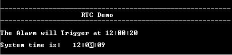

# RTC alarm interrupt

This example shows how to use the RTC to configure the time and generate the alarm.

## Description

This example application shows how to setup system time and configure alarm using the RTC Peripheral Library. The application sets up an alarm to be generated after 20 seconds of the configured system time. The application displays a message on the alarm trigger.

## Downloading and building the application

To download or clone this application from Github, go to the [top level of the repository](https://github.com/Microchip-MPLAB-Harmony/csp_apps_sam_d5x_e5x) and click

Path of the application within the repository is **apps/rtc/rtc_alarm/firmware/** .

To build the application, refer to the following table and open the project using its IDE.

| Project Name      | Description                                    |
| ----------------- | ---------------------------------------------- |
| sam_e54_xpro.X    | MPLABX Project for [SAM E54 Xplained Pro board](https://www.microchip.com/developmenttools/ProductDetails/atsame54-xpro)|
|||

## Setting up the hardware

The following table shows the target hardware for the application projects.

| Project Name| Board|
|:---------|:---------:|
| sam_e54_xpro.X    | [SAM E54 Xplained Pro board](https://www.microchip.com/developmenttools/ProductDetails/atsame54-xpro)|
|||

### Setting up [SAM E54 Xplained Pro board](https://www.microchip.com/developmenttools/ProductDetails/atsame54-xpro)

- Connect the Debug USB port on the board to the computer using a micro USB cable

## Running the Application

1. Open the Terminal application (Ex.:Tera term) on the computer
2. Connect to the EDBG Virtual COM port and configure the serial settings as follows:
    - Baud : 115200
    - Data : 8 Bits
    - Parity : None
    - Stop : 1 Bit
    - Flow Control : None
3. Build and Program the application project using its IDE
4. The console displays the current time and the alarm time (System time starts at 12:00:00 and gets updated every second)

    

5. Once the alarm time is reached, it print the alarm message and turns on the LED (System time keeps updating)

    

Following table provides the LED name:
| Board      | LED Name |
| ---------- | ---------------- |
| [SAM E54 Xplained Pro board](https://www.microchip.com/developmenttools/ProductDetails/atsame54-xpro)    | LED0 |
|||
