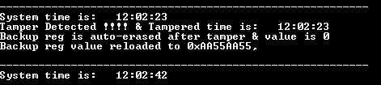

# RTC tamper detect

This example application shows how to configure and use tamper detect feature of RTC.

## Description

This example application shows how to setup system time and configure tamper detection using the RTC Peripheral Library. The application sets up system time and then waits for tamper detection to happen. On Tamper detection, application displays the tamper detected information and timestamp at which tamper is detected. Along with this, this example also demonstrates auto erase feature of backup register when tamper is detected. A known value is
loaded into Backup register and displayed through console terminal. After tamper detection, it is evident that the pre-loaded value in backup register is erased.

## Downloading and building the application

To download or clone this application from Github, go to the [top level of the repository](https://github.com/Microchip-MPLAB-Harmony/csp_apps_sam_d5x_e5x) and click

Path of the application within the repository is **apps/rtc/rtc_tamper_detect/firmware/** .

To build the application, refer to the following table and open the project using its IDE.

| Project Name      | Description                                    |
| ----------------- | ---------------------------------------------- |
| sam_e54_xpro.X    | MPLABX Project for [SAM E54 Xplained Pro board](https://www.microchip.com/developmenttools/ProductDetails/atsame54-xpro)|
|||

## Setting up the hardware

The following table shows the target hardware for the application projects.

| Project Name| Board|
|:---------|:---------:|
| sam_e54_xpro.X    | [SAM E54 Xplained Pro board](https://www.microchip.com/developmenttools/ProductDetails/atsame54-xpro)|
|||

### Setting up [SAM E54 Xplained Pro board](https://www.microchip.com/developmenttools/ProductDetails/atsame54-xpro)

- Connect the Debug USB port on the board to the computer using a micro USB cable

## Running the Application

1. Open the Terminal application (Ex.:Tera term) on the computer
2. Connect to the EDBG Virtual COM port and configure the serial settings as follows:
    - Baud : 115200
    - Data : 8 Bits
    - Parity : None
    - Stop : 1 Bit
    - Flow Control : None
3. Build and Program the application project using its IDE
4. System time is displayed in terminal session as RTC is configured in calendar mode.

    

    *NOTE: System time value shown in the screen capture are for illustration purpose only. it will be updated every second while running the application.*

5. To generate a tamper event, make the connection as follows:

    | Board      | Pad | Connection details |
    | ---------- | --- | ------------------ |
    | [SAM E54 Xplained Pro board](https://www.microchip.com/developmenttools/ProductDetails/atsame54-xpro)    | PB00 | Connect EXT 2, Pin 3 to GND to generate a falling edge on RTC_IN0 (tamper event)|
    |||

    *NOTE: Using wires/jumpers may cause multiple detection because of connectivity glitch while shorting*

6. Upon detection of the tamper event, LED will be toggled and the console output will be updated as follows:

    

Following table provides the LED name:

| Board      | LED Name |
| ---------- | ---------------- |
| [SAM E54 Xplained Pro board](https://www.microchip.com/developmenttools/ProductDetails/atsame54-xpro)    | LED0 |
|||
