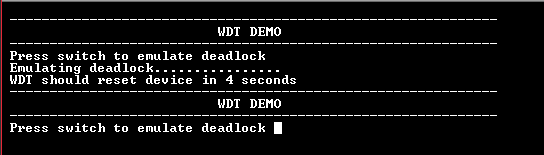

# WDT timeout

This example shows how to generate a Watchdog timer reset by emulating a deadlock.

## Description

This example application shows how the WDT peripheral library resets the watchdog timer by not feeding the watchdog on switch press. The application sets up the watchdog to reset the device. The application also sets up the timer to blink an LED to emulate a process. A user switch press forces the device to wait in an infinite loop to emulate a deadlock. As a result a device reset is triggered as the watchdog counter overflows the bounded value.

## Downloading and building the application

To download or clone this application from Github, go to the [top level of the repository](https://github.com/Microchip-MPLAB-Harmony/csp_apps_sam_d5x_e5x) and click

Path of the application within the repository is **apps/wdt/wdt_timeout/firmware** .

To build the application, refer to the following table and open the project using its IDE.

| Project Name      | Description                                    |
| ----------------- | ---------------------------------------------- |
| sam_e54_xpro.X    | MPLABX Project for [SAM E54 Xplained Pro board](https://www.microchip.com/developmenttools/ProductDetails/atsame54-xpro)|
|||

## Setting up the hardware

The following table shows the target hardware for the application projects.

| Project Name| Board|
|:---------|:---------:|
| sam_e54_xpro.X    | [SAM E54 Xplained Pro board](https://www.microchip.com/developmenttools/ProductDetails/atsame54-xpro)|
|||

### Setting up [SAM E54 Xplained Pro board](https://www.microchip.com/developmenttools/ProductDetails/atsame54-xpro)

- Connect the Debug USB port on the board to the computer using a micro USB cable

### Setting up [SAM V71 Xplained Ultra board](https://www.microchip.com/developmenttools/ProductDetails/atsamv71-xult)

- Connect the Debug USB port on the board to the computer using a micro USB cable

## Running the Application

1. Open the Terminal application (Ex.:Tera term) on the computer
2. Connect to the EDBG Virtual COM port and configure the serial settings as follows:
    - Baud : 115200
    - Data : 8 Bits
    - Parity : None
    - Stop : 1 Bit
    - Flow Control : None
3. Build and Program the application project using its IDE
4. LED should be blinking and the console displays the following message

    

5. Press the switch to put the system in a deadlock
6. LED should stop blinking and the console should print the following message

    

7. WDT will reset the device in four seconds and the demonstration should restart

Refer the table below for details of switch and LED

| Board      | Switch Name | LED Name |
| ---------- | ---------| ------------|
| [SAM E54 Xplained Pro board](https://www.microchip.com/developmenttools/ProductDetails/atsame54-xpro)    | SW0 | LED0 |
||||
